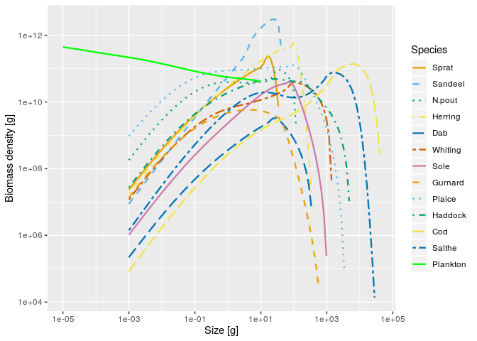
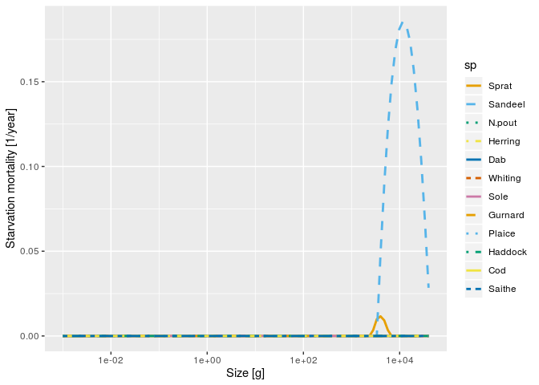

<!-- README.md is generated from README.Rmd. Please edit that file -->

# mizerStarvation

<!-- badges: start -->

<!-- badges: end -->

This is an extension package for the mizer package
(<https://sizespectrum.org/mizer/>) to implement starvation mortality.

## Installation

<!--
You can install the released version of mizerStarvation from [CRAN](https://CRAN.R-project.org) with: 

``` r 
install.packages("mizerStarvation") 
```
-->

You can install the development version of mizerStarvation from GitHub
with

``` r
devtools::install_github("sizespectrum/mizerStarvation")
```

## Example

This is an artificial example just to illustrate usage. We start with
the North Sea model that comes with the mizer package.

``` r
library(mizer)
library(mizerStarvation)
library(ggplot2)
params <- NS_params
```

We add starvation mortality

``` r
params <- setStarvation(NS_params, 10)
```

We increase metabolic loss artificially to induce starvation

``` r
params@species_params$ks <- params@species_params$ks * 1.3
params <- setMetab(params)
```

We can calculate the starvation mortality for each species as a function
of size with `getStarvMort()`:

``` r
starv_mort <- getStarvMort(params)
```

This returns an array that we can plot

``` r
ggplot(melt(starv_mort)) +
    geom_line(aes(x = w, y = value, colour = sp, linetype = sp), size = 1) +
    scale_x_log10() +
    xlab("Size [g]") +
    ylab("Starvation mortality [1/year]") +
    scale_colour_manual(values = params@linecolour) +
    scale_linetype_manual(values = params@linetype)
```


We find the new steady state and plot it

``` r
params <- steady(params)
plotSpectra(params, power = 2, ylim = c(1e4, NA))
```



Even in the steady state there is still some starvation mortality

``` r
ggplot(melt(getStarvMort(params))) +
    geom_line(aes(x = w, y = value, colour = sp, linetype = sp), size = 1) +
    scale_x_log10() +
    xlab("Size [g]") +
    ylab("Starvation mortality [1/year]") +
    scale_colour_manual(values = params@linecolour) +
    scale_linetype_manual(values = params@linetype)
```


